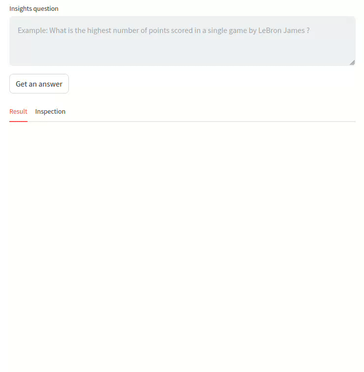
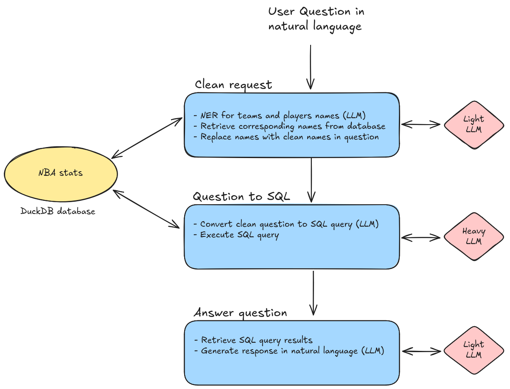

# NBA insights engine

[](https://github.com/pdgarden/nba-insights-engine/actions)


- [1. Project description](#1-project-description)
- [2. Prerequisites](#2-prerequisites)
- [3. Quickstart](#3-quickstart)
  - [3.1 Set up](#31-set-up)
  - [3.2 Run](#32-run)
  - [3.3. Environment variables](#33-environment-variables)
- [4. Workflow](#4-workflow)
- [5. Dataset](#5-dataset)
- [6. Benchmarks](#6-benchmarks)
- [7 Code Quality and Formatting](#7-code-quality-and-formatting)
- [8. Improvements](#8-improvements)
- [9. Complementary documentation](#9-complementary-documentation)


# 1. Project description

The following repo implements an insights engine for NBA related data. A user asks a question through a web app, this 
generates a SQL query executed in backend. The query result is then used to answer to the user.

Example of questions:
- What is the highest number of points scored by lebron james in a single game?
- What are the top 5 players with the most points per games in the 2022-2023 season?

---


---

# 2. Prerequisites

The project uses:
- uv (`v0.6.6`) to handle python version and dependencies.
- ollama (`v0.5.5`) by default, but this can be replaced by any other LLM through env var settings.


# 3. Quickstart


## 3.1 Set up

1. Install uv (v0.6.6):
   1. For macOS / Linux `curl -LsSf https://astral.sh/uv/0.6.6/install.sh | sh`
   2. For windows: `powershell -ExecutionPolicy ByPass -c "irm https://astral.sh/uv/0.6.6/install.ps1 | iex"`
2. Create virtual environment: `uv sync --all-groups`
3. Make sure your environment variables are correctly set up to use your desired inference provider
4. To develop (Optional):
   1. Setup pre-commit: `uv run pre-commit install -t commit-msg -t pre-commit`


## 3.2 Run

Once the set up is done, the app can be launched by executing the following command:

```sh
uv run python -m streamlit run app/insights_app.py
```

To run the benchmarks (you must have the env var `OPENROUTER_API_KEY` available to run the benchmarks):
```sh
uv run python benchmark/benchmark_ner_retrieval_pipeline.py
```

```sh
uv run python benchmark/benchmark_request_to_sql.py
```


## 3.3. Environment variables


The app works with two LLMs: one _heavy llm_ for the SQL generation and one _light llm_ for easy tasks like NER and retrieval.

The interaction with the LLM (model and API provider) is configured using environment variables. By default the light LLM is set to use `qwen2.5:7b` with `ollama` and the heavy LLM is set to use `llama-3.3-70b-instruct` with `OpenRouter`. You can leave as is and just need to provide your `OpenRouter` API key in environment variable (see below). But you can also use any other model and API provider compliant with OpenAI SDK. Here is the list of environment variables you can set:

| Environment Variable | Description | Default Value |
|---------------------|-------------|---------------|
| `LIGHT_LLM_BASE_URL` | Base URL of the light LLM API.\* | `http://localhost:11434/v1` |
| `LIGHT_LLM_API_KEY` | API key to connect to the light LLM API.\* | `ollama` |
| `LIGHT_LLM_MODEL` | Name of light LLM model used. Must be compatible with _structured_output_.\* | `qwen2.5:7b` |
| `HEAVY_LLM_BASE_URL` | Base URL of the heavy LLM API.\* | `https://openrouter.ai/api/v1` |
| `HEAVY_LLM_API_KEY` | API key to connect to the heavy LLM API.\* | *(Required)* |
| `HEAVY_LLM_MODEL` | Name of heavy LLM model used.\* | `meta-llama/llama-3.3-70b-instruct:free` |

_\* Used through OpenAI SDK._


To override the default values, you can set these environment variables directly in your environment, or in a `.env` file or at the repo's root. See .example in `env.example`

# 4. Workflow

Here is a brief overview of the system:




For the Named Entity Recognition (NER) task, the system uses a LLM, but I am currently working on a fine-tuned auto-encoder model to replace it.

# 5. Dataset

The NBA database used is a duckdb database, generated using duckdb and dbt with this [repo](https://github.com/pdgarden/nba-stats).
The current database contains data ranging from 1999 to 2024. This time span will be extended with future updates.

# 6. Benchmarks

Some benchmark are available in the `benchmarks` folder for :
- The question cleaning (Players and teams Named Entity Recognition): `benchmark_ner_retrieval_pipeline.py`
- The SQL query generation based on the user question: `benchmark_request_to_sql.py`

For each benchmark, a small test set was created and a bunch of models were tested.


**Name entity recognition and retrieval pipeline results:**

| Model* | Accuracy  |
|-------|---------- |
| smollm2:360m | 0% |
| llama3.2:3b | 90% |
| mistral:7b | 60%  |
| qwen2.5:7b | 100% |

\* _Model name from ollama_


**SQL generation pipeline results:**


| Model** | Accuracy (no thinking prompt) | Accuracy (thinking prompt) |
| - | - | - |
| deepseek/deepseek-chat-v3-0324 | 85% | 80% |
| moonshotai/kimi-k2 | 80% | 85% |
| qwen/qwen3-coder | 80% | 70% |
| meta-llama/llama-3.3-70b-instruct | 65% | 60% |
| qwen/qwen-2.5-72b-instruct | 75% | 75% |
| moonshotai/kimi-dev-72b | 70% | 75% |
| z-ai/glm-4.5-air | 75% | 75% |
| qwen/qwen-2.5-coder-32b-instruct | 55% | 75% |
| mistralai/mistral-small-3.2-24b-instruct | 60% | 60% |
| openai/gpt-oss-20b | 85% | 90% |
| hf.co/unsloth/Qwen3-30B-A3B-Instruct-2507-GGUF:UD-Q4_K_XL | 40% | 75% |

** _Model name from OpenRouter except for Qwen3-30B-A3B._


<details>
  <summary>No thinking prompt</summary>

```
    You are an expert in SQL and NBA data.
    A user asks you this question:

    {nba_data_query}


    Generate a valid SQL query which will answer his question.
    Be concise. Only retrieve the SQL query an nothing else.

    Example of expected return:
    ```sql
    select t.column1, t.column2
    from table t
    where t.column3 = 'value'
    ```

    To answer, you have access to a PostgreSQL database with the following tables:
    {db_description}

```

</details>

<details>

  <summary>Thinking prompt</summary>

  ```
  # Persona

  You are data analyst specialized in BasketBall and NBA analytics.
  Your main job is to receive questions from users and convert it into SQL queries.


  # Instructions

  A user asks you this question:

      {nba_data_query}

  Your task is to generate a valid SQL query which answers his question.
  Start by thinking about the question and break it down step by step to figure out which tables you should use, how to join them, and so on.

  # Output format

  - You will start to think in a thinking tag following this format: <thinking>your-thoughts...</thinking>
  - You wil then put the sql query in a sql query tag following this format: <>```sql select ...```</sql_query>


  # Example of expected return:

  ## User query: What is the name of the player who played the most minutes in the 2010 calendar year ? How many minutes did he play during this year?

  ## Your response:

  <thinking>
  In order to answer this question:

  I need to extract the following informations:
  - player name: in `player.player_name`
  - number of minutes per games: in `game_boxscore.minute_played`
  - game date: in `game_summary.date`

  I then need to find the matching keys between these tables:
  - (player, game_boxscore): (id, player_id)
  - (game_boxscore, game_summary): (game_id, game_summary.id)

  I then need to filter the data: where game_summary.date in calendar year 2010
  I then need to aggregate the data: By player_id, to compute the sum of minute_played
  I then need to order the result by sum of minute_played by descending order
  I then need to limit the result to 1
  </thinking>

  <sql_query>
  ```sql
  select p.player_name, sum(gb.minute_played) sum_minutes_played
  from player p
  inner join game_boxscore gb on gb.player_id = p.id
  inner join game_summary gs on gs.id = gb.game_id
  where extract(year from gs.date = 2010
  order by 2 desc
  limit 1
  ``` \

  <sql_query>

  # Data

  To answer, you have access to a PostgreSQL database with the following tables:
  {db_description}

  The SQL request that you'll generate will need to work effectively with the datbase, thus respecting the schema, keys, tables names, columns names and so on.

  ```

</details>


# 7 Code Quality and Formatting

- The python files are linted and formatted using ruff, see configuration in `pyproject.toml`
- Pre-commit configuration is available to ensure trigger quality checks (e.g. linter)
- Commit messages follow the conventional commit convention
- A CI/CD pipeline is implemented with github actions to lint the code


# 8. Improvements

- Dataset
  - Increase dataset's timeframe (Right now from 1999 to 2024)
  - Move duckdb database to cloud (e.g. motherduck)
- App
  - Handle TODO tags
  - Add retry mechanism on llm calls (when retrieve null value or incorrect SQL query)
  - Display plot based on generated result
  - Better error handling
- Improve text to SQL results:
  - Test intermediate step to generate sql request by filtering the columns / tables to use
  - Add reflection step on result with possible modification
  - Inject prompt in system message instead of user message
  - Generate several responses
  - Improve the prompt
    - Add example values for each column
    - Add a description for each column
    - Include only a subset of tables/columns in the prompt (for 2 steps query creation)
    - Add example of CTEs (Common Table Expressions) or mentions if needed
    - Include examples
    - Avoid requiring the thinking process to be wrapped in tags


# 9. Complementary documentation

- [Ollama](https://ollama.com/): To interact with the LLMs
- [OpenRouter](https://openrouter.ai/): To interact with the LLMs
